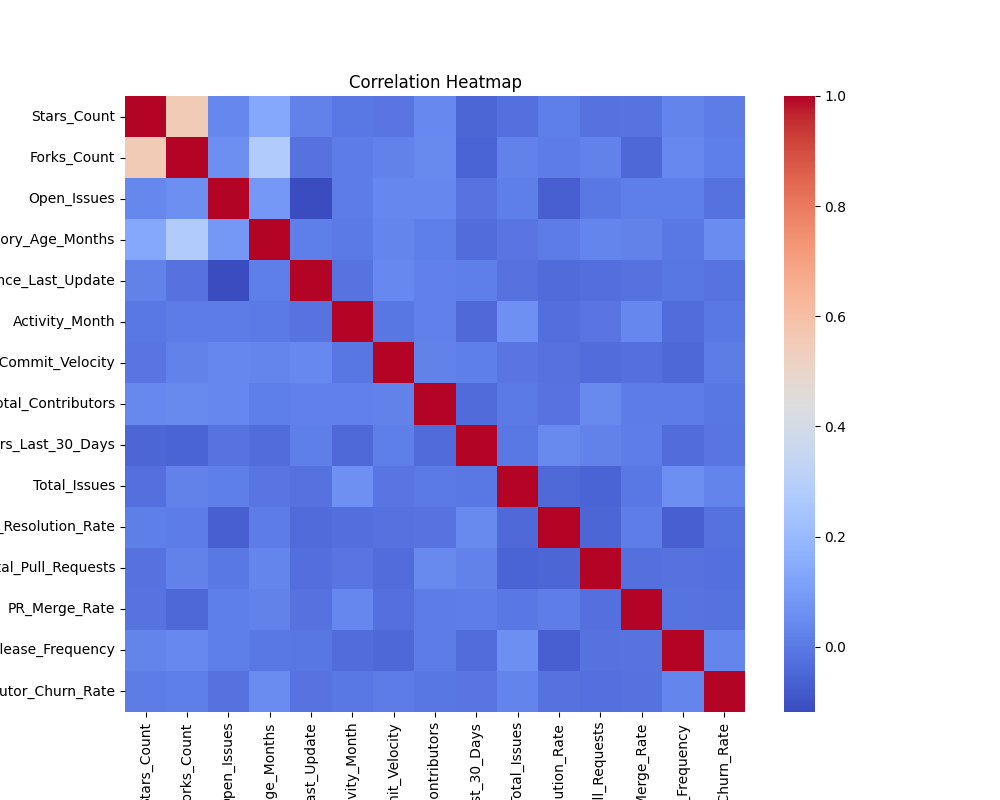
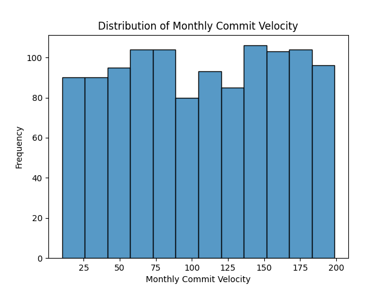
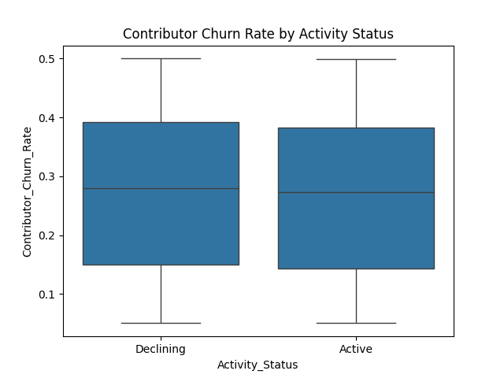
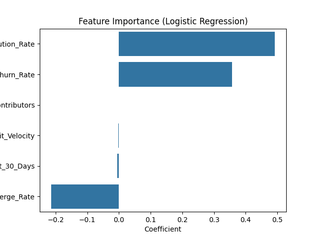
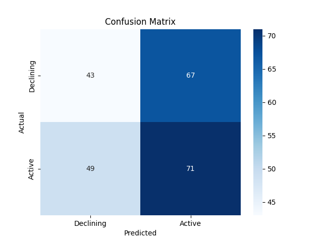

# 📊 Open-Source Project Health Analysis


A data science project that analyzes the health of open-source GitHub repositories and predicts whether a repository is likely to remain active or enter a declining state using repository activity metrics collected through the GitHub API.

---

# 📌 Project Overview

Open-source software powers a large portion of modern technology. However, many repositories gradually become inactive due to declining contributor engagement, reduced development activity, or poor project maintenance.

This project aims to identify patterns associated with repository decline by analyzing real GitHub repository data and exploring the relationship between repository activity metrics and project health.

---

# 🎯 Objectives

- Collect repository statistics using the GitHub API.
- Analyze contributor and development activity.
- Perform Exploratory Data Analysis (EDA).
- Engineer meaningful repository health features.
- Build a predictive model for repository activity status.
- Visualize relationships between repository metrics.

---

# 📂 Dataset

**Source:** GitHub REST API

Dataset contains **1,150 observations** with **18 features** extracted from public repositories.

### Features include

- Repository Age
- Primary Language
- Stars
- Forks
- Open Issues
- Total Issues
- Total Pull Requests
- Pull Request Merge Rate
- Commit Velocity
- Contributors
- Contributor Churn Rate
- Release Frequency
- Days Since Last Update
- Issue Resolution Rate
- Activity Month
- Activity Status (Target Variable)

---

# 🛠️ Tech Stack

- Python
- Pandas
- NumPy
- Matplotlib
- Seaborn
- Scikit-learn
- GitHub REST API
- Jupyter Notebook

---

# 🔄 Workflow

```
GitHub API
      │
      ▼
Data Collection
      │
      ▼
Data Cleaning
      │
      ▼
Feature Engineering
      │
      ▼
Exploratory Data Analysis
      │
      ▼
Logistic Regression
      │
      ▼
Prediction & Evaluation
```

---

# 📈 Exploratory Data Analysis

The project includes multiple visualizations to understand repository behavior.

## Correlation Heatmap

Shows relationships between repository metrics.



---

## Monthly Commit Velocity Distribution

Visualizes commit activity across repositories.



---

## Contributor Churn Analysis

Compares contributor churn between active and declining repositories.



---

## Logistic Regression Feature Importance

Illustrates the contribution of important repository metrics to prediction.



---

## Confusion Matrix

Evaluation of the predictive model.



---

# 🤖 Machine Learning

### Model

- Logistic Regression

### Evaluation

Dataset Shape

```
1150 rows × 18 columns
```

Classification Report

```
Precision (Declining): 0.47
Recall (Declining):    0.39

Precision (Active):    0.51
Recall (Active):       0.59
```

The project demonstrates the complete machine learning workflow including data collection, preprocessing, visualization, feature engineering, model development, and evaluation.

---

# 📊 Key Insights

- Repository activity depends on multiple metrics rather than a single indicator.
- Contributor churn influences long-term repository sustainability.
- Issue resolution and pull request merge rates provide useful signals regarding repository health.
- Commit velocity alone is not sufficient for determining project activity.
- Repository maintenance is strongly associated with sustained development.

---

# 🚀 Installation

Clone the repository

```bash
git clone https://github.com/kohli30/Open-Source-Project-Health-Analysis.git
```

Install dependencies

```bash
pip install -r requirements.txt
```

Run the notebook

```bash
jupyter notebook
```

---

# 📁 Project Structure

```
Open-Source-Project-Health-Analysis
│
├── dataset/
├── images/
├── notebooks/
├── src/
├── requirements.txt
├── README.md
└── LICENSE
```

---

# 🔮 Future Improvements

- Experiment with Random Forest and XGBoost.
- Collect larger repository datasets.
- Deploy the model using Flask or Streamlit.
- Develop a repository health dashboard.
- Add time-series analysis for repository activity.

---

# 👨‍💻 Author

**Aditya Kohli**

GitHub: https://github.com/kohli30

LinkedIn: https://www.linkedin.com/in/aditya-k-b3812928b/

---

## ⭐ If you found this project interesting, consider giving it a star!
